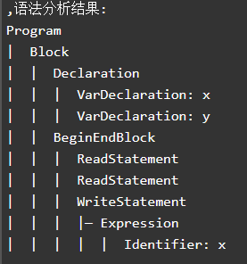
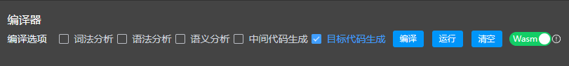

<div style="font-size:0.9rem">

# 记录一下编译器的简单开发

本文主要是记录个人PL0编译器的开发过程，面向开发的对编译过程的一次梳理，并且进行记录，如果有理解不到位的地方，还希望大家指出（我编译原理可菜了）

**对于文中不严谨的地方，还望大家评论指出**

---

## 前言

全文概览：

<div style="font-size:0.9rem">

- [记录一下编译器的简单开发](#记录一下编译器的简单开发)
  - [前言](#前言)
  - [对编译过程的简单概括](#对编译过程的简单概括)
  - [词法分析](#词法分析)
    - [实现过程](#实现过程)
  - [语法分析](#语法分析)
    - [实现过程](#实现过程-1)
  - [语义分析](#语义分析)
    - [实现过程](#实现过程-2)
  - [中间代码生成](#中间代码生成)
    - [实现过程](#实现过程-3)
  - [目标代码生成](#目标代码生成)
    - [实现过程](#实现过程-4)
  - [一些其他内容（优化等等）](#一些其他内容优化等等)
    - [对于语法分析过程中的优化](#对于语法分析过程中的优化)
    - [目标代码优化过程中的优化](#目标代码优化过程中的优化)
  - [结语](#结语)

</div>

---

## 对编译过程的简单概括

编译过程，在我看来就是将A代码转换成B代码的一个过程，在主流的场景下，A代码可以是一些高级计算机语言，比如JS、Java等等；B代码则更多是低级别代码语言，比如机器码、汇编、WASM等。这项差别也直接说明了编译的目标————将人类可读的代码转换成机器可=8读的代码。

整个完整的编译过程主要有六步：

1. 词法分析
2. 语法分析
3. 语义分析
4. 中间代码生成
5. 目标代码优化
6. 目标代码生成

不过在我开发过程中，对于其中的第五步“目标代码优化”穿插在了中间代码生成和目标代码生成中，而不是单独拎出来进行处理的，因此我的开发模块主要是开发了另外五步，接下来我将简单介绍我对每一个编译模块开发的实践和理解：

---

## 词法分析

<div style="font-size:0.9rem">
词法分析，目的上，主要是为了将源代码分解成一个个token，每个token包括了单词的类型和value，或者说每个token都是当前语法中的最小的有意义的字符序列，例如关键字、标识符、变量等等；

对于我的词法分析器`lexicalAnalysis`,主要是读取前端发来的代码文本（字符串），移除空白和注释，然后基于pl0的语法将文本内容分解成一个个token，最终获取token stream用于后续语法分析等流程。

### 实现过程

初始化tokens用于以此保存所有token，初始化cur指针，用于依次处理每个char，并且利用正则来进行不同类型的char的识别，例如

```
// 空格
const isWhitespace = (char) => /\s/.test(char);
// 字母
const isLetter = (char) => /[a-zA-Z]/.test(char);
// 数字
const isDigit = (char) => /\d/.test(char);
//...等等处理其他类型的char
```

这里需要注意，对于一些双符号操作符或者变量，可能需要利用nextChar来进行处理或者利用多次循环的拼接来处理，
对于遍历完毕之后，规范上需要添加一个"EOF"来标识终结符，告知语法分析器结束，实现如下：

```
// EOF表示终止符
tokens.push({ type: "EOF", value: null, line: currentLine });
```

至此，最终能够获取最后的tokens，用于后续的语法分析，格式如下(示例)：

```
"LexicalAnalysis": [
            {
                "type": "Keyword",
                "value": "var",
                "line": 1
            },
            {
                "type": "Identifier",
                "value": "x",
                "line": 1
            },
            {
                "type": "Semicolon",
                "value": ";",
                "line": 1
            },
            {
                "type": "Keyword",
                "value": "begin",
                "line": 2
            },
            {
                "type": "Identifier",
                "value": "x",
                "line": 3
            },
            ...,
            {
                "type": "End",
                "value": ".",
                "line": 22
            },
            {
                "type": "EOF",
                "value": null,
                "line": 22
            }
        ]
```

</div>

## 语法分析

<div style="font-size:0.9rem">
语法分析，目的上，主要是用于构建基于token的一个AST，用于检查程序的语法结构的层次以及是否符合语法规则；

### 实现过程

对于我的语法分析器`syntaxAnalysis`,主要是根据词法分析的产物tokens(token stream)构建AST，结合了递归下降分析实现的，在开发语法分析器的时候，要结合pl0的文法规则(语法规则)，对token逐一进行处理；在这个过程中，如果遇到语法错误，编译器需要报告错误，并终止编译过程；据我的体验，语法分析应该是整个编译过程中最难写的了，十分繁琐，这可能需要结合对应的文法规则，实现如下：

初始化的时候，需要初始化curIndex用于追踪当前处理到的token，同时需要初始化一个SymbolTable用于追踪变量和方法（在pl0称为procedure）。
接下来需要处理几个核心方法

- analyze：入口方法，初始化tokens，进行处理，并返回ast；
- match：核心方法，用于匹配当前token是否和期望类型或者值匹配，匹配则前进一个curIndex，否则抛出异常；

```
  // 匹配
match(expectedType, expectedValue = null) {
  if (this.currentToken && this.currentToken.type === expectedType) {
    // 如果提供了expectedValue，则还需要匹配token的具体值
    if (expectedValue !== null && this.currentToken.value !== expectedValue) {
      throw new Error(
        `Expected token value ${expectedValue}, but found ${this.currentToken.value}`
      );
    }
    this.advance();
  } else {
    // 抛出错误时，包含更多关于期望和实际的信息
    const foundType = this.currentToken ? this.currentToken.type : "EOF";
    const foundValue = this.currentToken ? this.currentToken.value : "None";
    throw new Error(
      `Expected token type ${expectedType}${
        expectedValue ? " with value " + expectedValue : ""
      }, but found type ${foundType} with value ${foundValue}`
    );
  }
},    
```

- peek：预测下一个token的值，通常用于避免回溯，进行优化；
- advance：curIndex++，移动指针；
- program：解析tokens的核心文件，是整个ast的根节点，用于在最外层遍历token，一旦识别到EOF，则退出循环，结束遍历；

```
program() {
    const nodes = [];
    // 判断是否到了最后一个标签
    while (this.currentToken && this.currentToken.type !== "EOF") {
      nodes.push(this.block());

      if (this.currentToken && this.currentToken.value === ".") {
        // 匹配`end`
        this.advance();
      }
    }
    return {
      type: "Program",
      children: nodes,
      line: this.currentToken.line,
    };
  },
```

- block：对一个代码块上下文的处理，有两部分，一个是声明阶段（非必要），一个是语句处理（相对必要）；
- declaration：声明阶段，主要是对pl0的“var”和“const”声明的内容进行初始化和追踪；
- statement：对于其他语句的处理，首先要判断是**单词**还是**关键字**，分别对不同类型进行处理，如果是**单词**，则是过程的声明或者调用，并对不同情况进行处理；如果是**关键字**，则需要利用Switch对不同类型的语句进行特殊处理，处理内容如下：
  - if/while/for/call/read/write等语句的处理

```
// 对几个比较负责的语句处理进行展示（for和if）
//for循环的处理
forStatement() {
    this.match("Keyword", "for"); //for循环处理
    const variableName = this.currentToken.value;
    const forLine = this.currentToken.line;
    this.match("Identifier");
    this.match("Equals", ":=");
    const initialValue = this.expression(); // 匹配for初始化的表达式
    this.match("Keyword", "to"); //
    const finalValue = this.expression(); //
    this.match("Keyword", "do"); //
    let loopBody = null;
    if (this.currentToken.value === "begin") {
      // 如果循环体以 'begin' 开始，则预期是多条语句
      loopBody = this.beginEndStatement(); // 解析 begin...end 结构
      this.match("Semicolon");
    } else {
      // 否则，解析单条语句作为循环体
      loopBody = this.statement(); // 解析单条语句
      this.match("Semicolon", ";");
    }

    // ;
    this.match("Keyword", "end");
    this.match("Semicolon", ";");
    return {
      type: "ForStatement",
      variableName: variableName,
      initialValue: initialValue,
      finalValue: finalValue,
      body: loopBody,
      line: forLine,
    };
  },
// if语句的处理，重点在于if-elseif-...-else语句的递归处理
  ifStatement() {
    this.match("Keyword", "if"); // 匹配 'if'
    const condition = this.expression(); // 解析条件表达式
    this.match("Keyword", "then"); // 匹配 'then'
    const ifLine = this.currentToken.line;
    let thenStatement = null;
    // 直接检查下一个token，决定是解析单条语句还是多条语句
    if (this.currentToken.value === "begin") {
      // 如果是begin，则预期为多条语句，使用beginEndStatement解析
      thenStatement = this.beginEndStatement();
      this.match("Semicolon");
    } else {
      // 否则，解析单条语句
      // thenStatement = this.parseSingleStatement();
      thenStatement = this.statement();
      // this.match("Semicolon");
    }
    let elseStatement = null;
    const elseIfStatements = [];
    while (this.currentToken.value === "else") {
      this.match("Keyword", "else");
      if (this.currentToken.value === "if") {
        this.match("Keyword", "if");
        const elseifCondition = this.expression();
        this.match("Keyword", "then");
        if (this.currentToken.value === "begin") {
          // 如果是begin，则预期为多条语句，使用beginEndStatement解析
          const elseifThenStatement = this.beginEndStatement();
          this.match("Semicolon");
          elseIfStatements.push({
            condition: elseifCondition,
            thenStatement: elseifThenStatement,
          });
        } else {
          // 否则，解析单条语句
          // thenStatement = this.parseSingleStatement();
          const elseifThenStatement = this.statement();
          // this.match("Semicolon");
          elseIfStatements.push({
            condition: elseifCondition,
            thenStatement: elseifThenStatement,
          });
        }
        // this.match("Semicolon");
      } else {
        if (this.currentToken.value === "begin") {
          elseStatement = this.beginEndStatement();
          this.match("Semicolon");
        } else {
          elseStatement = this.statement();
          // this.match("Semicolon");
        }
      }
    }
    this.match("Keyword", "end");
    this.match("Semicolon");
    return {
      type: "IfStatement",
      condition: condition,
      thenStatement: thenStatement,
      elseIfStatement: elseIfStatements,
      elseStatement: elseStatement,
      line: ifLine,
    };
  },
```

- parse:主要是一些对变量或者过程名的处理；
  - 对于变量声明或赋值、过程调用等语句的解析
- expression：算术表达式的处理，有几个核心方法，但是是按照已有的顺序进行处理，避免出现左递归问题；
  - 解析顺序控制————大小比较、加减法、乘除法、因子处理

```
 // 逻辑表达式的解析
  expression() {
    let left = this.arithmeticExpression(); // 首先解析算术表达式
    while (
      this.currentToken &&
      ["<", "<=", "=", "<>", ">", ">="].includes(this.currentToken.value)
    ) {
      const operator = this.currentToken.value;
      const line = this.currentToken.line;
      this.match("Operator"); // 匹配比较操作符
      let right = this.arithmeticExpression(); // 再次解析算术表达式作为右侧
      // 构建比较表达式的AST节点
      left = {
        type: "BinaryExpression",
        operator: operator,
        left: left,
        right: right,
        line: line,
      };
    }
    return left;
  },
  // 计算解析（加减法）
  arithmeticExpression() {
    let node = this.term();
    while (this.currentToken && ["+", "-"].includes(this.currentToken.value)) {
      const operator = this.currentToken.value;
      const line = this.currentToken.line;
      this.match("Operator", operator); // 匹配加减运算符
      const right = this.term(); // 解析右侧的term
      node = {
        type: "BinaryExpression",
        operator: operator,
        left: node,
        right: right,
        line: line,
      };
    }
    return node;
  },
  // 计算解析（乘除法）
  term() {
    let node = this.factor();
    while (this.currentToken && ["*", "/"].includes(this.currentToken.value)) {
      const operator = this.currentToken.value;
      const line = this.currentToken.line;
      this.match("Operator", operator); // 匹配乘除运算符
      const right = this.factor(); // 解析右侧的factor
      node = {
        type: "BinaryExpression",
        operator: operator,
        left: node,
        right: right,
        line: line,
      };
    }
    return node;
  },
  // 因子解析
  factor() {
    // 这个方法需要解析数字和括号内的表达式
    if (this.currentToken.type === "Number") {
      const node = {
        type: "Literal",
        value: this.currentToken.value,
        line: this.currentToken.line,
      };
      this.advance(); // 前进到下一个token
      return node;
    } else if (this.currentToken.type === "Identifier") {
      const node = {
        type: "Identifier",
        name: this.currentToken.value,
        line: this.currentToken.line,
      };
      this.advance(); // 前进到下一个token
      return node;
    } else if (this.currentToken.value === "(") {
      this.match("Operator", "("); // 匹配左括号
      let node = this.expression(); // 解析括号内的表达式
      this.match("Operator", ")"); // 匹配右括号
      return node;
    }
    throw new Error(`Unexpected token: ${this.currentToken.value}`);
  },
```

通过上述的几个核心方法，语法分析器会在调用analyze(tokens)的时候，执行一系列方法，依次读取tokens，并构建AST，JSON格式如下：

```
"SyntaxAnalysis": {
            "type": "Program",
            "children": [
                {
                    "type": "Block",
                    "children": [
                        {
                            "type": "Declaration",
                            "children": [
                                {
                                    "type": "VarDeclaration",
                                    "name": "x",
                                    "line": 1
                                },
                                {
                                    "type": "VarDeclaration",
                                    "name": "y",
                                    "line": 1
                                }
                            ],
                            "line": 3
                        },
                        {
                            "type": "BeginEndBlock",
                            "statements": [
                                {
                                    "type": "ReadStatement",
                                    "variableName": "x",
                                    "line": 4
                                },
                                {
                                    "type": "ReadStatement",
                                    "variableName": "y",
                                    "line": 5
                                },
                                {
                                    "type": "WriteStatement",
                                    "expression": {
                                        "type": "Identifier",
                                        "name": "x",
                                        "line": 6
                                    },
                                    "line": 6
                                }
                            ],
                            "line": 4
                        }
                    ],
                    "line": 7
                }
            ],
            "line": 7
        }
```

经过加工后的前端显示格式如下：
<div style="text-align:center">
<!--  -->

</div>
在构建AST完成之后，会利用AST进行语义分析和中间代码生成处理。

</div>

## 语义分析

<div style="font-size:0.9rem">
语义分析，目的上，主要是确保AST在语义上是合法的，比如变量的声明和赋值等等（pl0主要是这一点）；

### 实现过程

对于我的语义分析器`semanticAnalysis`,要根据AST以及追踪生成一个有意义的符号表，用于检查变量的声明和使用、过程的声明和调用、算术表达式的使用是否有意义，同时遍历不同Statement的节点（if、for）来追踪变量的使用；受限于pl0语法的限制，我简化了这一分析器，因为pl0里主要是在全局进行变量的声明，而不需要对每一个上下文进行处理。实现如下：

初始化的时候，需要初始化curIndex用于追踪当前处理到的token，同时需要初始化一个SymbolTable用于追踪变量和方法（在pl0称为procedure）。
接下来需要处理几个核心方法

- analyze：入口方法，初始化SymbolTable，执行节点的遍历，返回值为符号表；
- init：初始化一个SymbolTable，记录符号表；
- processNode：对不同类型节点的处理，Switch去调用不同的详细处理方法，比如子节点的处理、变量的处理、Statement语句的遍历等；
- processChildren&&processStatement：对于block类型和Statement类型的结构的处理，因为他们可能包含多个子节点，利用forEach进行遍历执行；
- processDeclaration等追踪变量以及过程名的方法：核心内容，结合SymbolTable，检查语义是否异常，实现如下：

```
// 变量声明
  processDeclaration(node) {
    node.children.forEach((decl) => {
      const name = decl.name;
      if (this.symbolTable[name]) {
        throw new Error(`Variable ${name} is already declared.`);
      }
      this.symbolTable[name] = { type: decl.type, value: null }; // 声明变量，默认值为null
    });
  },
  // 过程声明
  processProcedureDeclaration(node) {
    const name = node.name;
    if (this.symbolTable[name]) {
      throw new Error(`Procedure ${name} is already declared.`);
    }
    this.symbolTable[name] = {
      type: "Procedure",
      parameters: [],
      body: node.body,
    };
    // 这里可以递归分析过程体，以处理局部变量等
  },

  processAssignmentStatement(node) {
    const name = node.identifier;
    if (!this.symbolTable[name]) {
      throw new Error(`Variable ${name} is not declared.`);
    }
    // 这里可以对赋值表达式进行分析，暂略
  },
  // 过程调用
  processProcedureCall(node) {
    const name = node.name;
    if (
      !this.symbolTable[name] ||
      this.symbolTable[name].type !== "Procedure"
    ) {
      throw new Error(`Procedure ${name} is not declared.`);
    }
    // 对过程调用进行分析，这里简化处理，实际中可能需要检查参数
  },
```

总体来说，语义分析主要是对于SymbolTable的构建，利用SymbolTable检查代码是否存在语义上的歧义，同时生成的符号表也可以为后续调试等功能提供相应数据，其大概格式为：

```
"SemanticAnalysis": {
            "x": {
                "type": "VarDeclaration",
                "value": null
            },
            "y": {
                "type": "VarDeclaration",
                "value": null
            }
        }
```

后续可能会利用符号表提取常量和变量的数据，做一些二次处理，这些会在后面的调试器内容中提到；

</div>

## 中间代码生成

<div style="font-size:0.9rem">
中间代码生成，目的上，主要是结合AST，将其转换成一种中间表示（IR），抽象于高级计算机语言和机器码之间，即能够让开发人员能够读懂，便于后续维护和优化；有需要方便转换成目标机器码；我这里是用了一种类似汇编语言的格式来呈现的中间代码；

### 实现过程

对于我的中间代码生成器`intermediateCodeGeneration`,是基于语法分析器的产物AST开始处理的，整体其实也是利用DFS进行对AST的遍历处理。生成实现如下：

这里主要是一个核心方法，利用深度优先遍历的方式从根节点出发，直到遍历到叶子结点，对叶子结点进行对应的中间代码生成，核心片段代码展示(省略了一些语句的处理，只是用于展示说明)：

```
// 对每个节点的处理操作
switch (node.type) {
      case "Program":
      // 对非叶子节点的处理
      case "Block":
        node.children?.forEach((child) =>
          this.generateCodeFromNode(child, intermediateCode)
        );
        break;

      case "BeginEndBlock":
        node.statements.forEach((statement) =>
          this.generateCodeFromNode(statement, intermediateCode)
        );
        break;
      // 对于声明语句的处理  
      case "Declaration":
        node.children.forEach((decl) => {
          const code =
            decl.type === "VarDeclaration"
              ? `DECLARE ${decl.name}`
              : `CONST ${decl.name} = ${decl.value}`;
          intermediateCode.push({ code, line: decl.line });
        });
        break;
      // 赋值处理
      case "AssignmentStatement":
        this.generateCodeFromNode(node.expression, intermediateCode); // 先处理表达式
        intermediateCode.push({
          code: `STORE ${node.identifier}`,
          line: node.line,
        });
        break;
      // 过程调用  
      case "ProcedureCall":
        intermediateCode.push({ code: `CALL ${node.name}`, line: node.line });
        break;
      // if语句处理  
      case "IfStatement":
        this.generateCodeFromNode(node.condition, intermediateCode);
        intermediateCode.push({ code: "IF", line: node.line });
        this.generateCodeFromNode(node.thenStatement, intermediateCode);
        if (node.elseIfStatement) {
          node.elseIfStatement.forEach((elseif) => {
            this.generateCodeFromNode(elseif.condition, intermediateCode);
            // console.log(elseif);
            intermediateCode.push({
              code: "ELSEIF",
              line: elseif.condition.line,
            });
            this.generateCodeFromNode(elseif.thenStatement, intermediateCode);
          });
        }
        if (node.elseStatement) {
          intermediateCode.push({
            code: "ELSE",
            line: node.elseStatement.line,
          });
          this.generateCodeFromNode(node.elseStatement, intermediateCode);
        }
        intermediateCode.push({ code: "ENDIF", line: node.line }); // 可能需要调整行号
        break;
      // for循环语句的处理  
      case "ForStatement":
        this.generateCodeFromNode(node.initialValue, intermediateCode);
        intermediateCode.push({
          code: `FOR ${node.variableName} INIT`,
          line: node.line,
        });
        this.generateCodeFromNode(node.finalValue, intermediateCode);
        intermediateCode.push({
          code: `FOR ${node.variableName} TO`,
          line: node.line,
        });
        this.generateCodeFromNode(node.body, intermediateCode);
        intermediateCode.push({
          code: `ENDFOR ${node.variableName}`,
          line: node.line,
        });
        break;
      // 算术表达式的处理  
      case "BinaryExpression":
        this.generateCodeFromNode(node.left, intermediateCode);
        this.generateCodeFromNode(node.right, intermediateCode);
        intermediateCode.push({
          code: `OPER ${node.operator}`,
          line: node.line,
        });
        break;

      case "Literal":
        intermediateCode.push({ code: `PUSH ${node.value}`, line: node.line });
        break;

      case "Identifier":
        intermediateCode.push({ code: `LOAD ${node.name}`, line: node.line });
        break;

      default:
        console.warn(`Unhandled node type: ${node.type}`);
    }
```

中间代码生成器在根据AST生成中间代码的过程的同时，也会同时携带对应的line，便于在目标代码生成的时候携带line，用于pl0代码和目标代码的映射处理；上述代码段只显示了部分语句的处理，由于篇幅限制，并没有提供完整代码，中间代码的格式在前端的显示效果如下（for循环示例）：

<!-- <div style="text-align:center">

</div> -->
<div style="text-align:center">

</div>

生成中间代码之后，可以进行最后的目标代码生成处理。

</div>

## 目标代码生成

<div style="font-size:0.9rem">
目标代码生成，顾名思义，是整个编译的最后一步，需要根据中间代码生成最后的能交给机器执行的可执行代码；

### 实现过程

对于我的目标代码生成器`targetCodeGeneration`,我主要是设计了两个版本，因为一开始了解到WASM在web端执行效率高，所以一开始的目标代码为WAT（WASM的文本格式，WASM本身是二进制格式，过于抽象）；但是受限于WASM执行无法中断的特点，我又新增了一个目标代码为JS的格式，用于前端方便的实现中断、继续、调试等功能。由于JS可读性更好，所以我这边展示的代码片段主要是JS生成器的代码片段，实现如下：

初始化阶段，需要初始化的内容主要有以下几个内容：

1. variableDeclarations：主要是用于实现类似符号表的功能，避免出现重复声明的问题，使用的Set数据结构进行存储；
2. varStack：利用栈的结构调用变量，由于中间代码有store和load两个处理，所以在使用一个变量的时候可能要进行入栈和出栈操作；
3. loopLabelsStack：对循环语句的记录，主要是判断是否是在循环语句之中；
4. conditionStack：主要是对于WASM模式下的if-elseif-else的处理；
5. functionsCode：生成的目标代码的最终文本格式；

在生成的过程中，对于每个**中间代码行**进行解构操作，例如`const [operation, operand1, operand2] = code.split(" ");`,从而获取对应的指令和一些参数（operand可能为undefined），从而利用Switch语句对每个operation进行判断处理，执行一些对应的操作，其中，对于算术表达式、if语句等等语句需要进行特殊处理，核心代码片段展示如下：

```
//对于算术表达式的处理
  handleOperation(operation, left, right) {
    const operatorMappings = {
      "+": `${left} + ${right}`,
      "-": `${left} - ${right}`,
      "*": `${left} * ${right}`,
      "/": `${left} / ${right}`,
      ">": `${left} > ${right}`,
      "<": `${left} < ${right}`,
      "=": `${left} == ${right}`,
      // Add more operators as needed
    };
    // console.log(operation);
    // console.log(operatorMappings);
    return operatorMappings[operation];
  },
// 对于一些条件语句的处理（js的相对简单，WASM需要利用conditionStack来控制结束）
  handleCondition(operation, operand1, operand2, line) {
    switch (operation) {
      case "IF":
        const conditionIf = this.varStack.pop();
        return `if (${conditionIf}) {//${line}\n`;
      case "ELSEIF":
        const conditionElseIf = this.varStack.pop();
        return `} else if (${conditionElseIf}) {//${line}\n`;
      case "ELSE":
        return `} else {//${line}\n`;
      case "ENDIF":
        return `}//${line}\n`;
      default:
        return "// Unhandled condition\n";
    }
  },
// 循环语句处理
  handleLoop(operation, operand1, operand2, line) {
    switch (operation) {
      case "WHILE":
        return `while (`;
      case "DO":
        const result = this.varStack.pop();
        // DO logic here if your intermediate code requires it
        return `${result}){//${line}\n`;
      case "ENDWHILE":
        return `}//${line}\n`;
      case "FOR":
        if (operand2 === "INIT") {
          return `for (${operand1} = 0;${operand1} < `;
        } else if (operand2 === "TO") {
          return `${this.varStack.pop()};${operand1}++){//${line}\n`;
        }
      // Assuming FOR loop structure is defined in your intermediate code
      // return `for (let ${operand1} = 0; ${operand1} < ${operand2}; ${operand1}++) {\n`;
      case "ENDFOR":
        return `}//${line}\n`;
      default:
        return "// Unhandled loop\n";
    }
  },
```

对于目标代码的生成，我还在每一行进行了注释添加，注释后面添加的内容是当前js行对应的pl0源代码的行数，实现一种简单的映射，便于前端用户的查看，同时也方面后续调试功能的映射处理。目标代码在前端的展示效果如下，对于同一段代码的解析，JS格式如下：
<div style="text-align:center">

</div>
WASM格式如下：
<div style="text-align:center">

</div>
最终服务端返回目标代码，前端会对响应的内容做二次处理并执行，对于read和write方法需要前端或者后端自己额外配置，这可能涉及到不同的语法，同时会涉及到一些中断（异步）处理等。

</div>

## 一些其他内容（优化等等）

### 对于语法分析过程中的优化

- 左递归问题：本身我的pl0语法规则不包含显示的左递归的，左递归通常发生在类似`A->Aa | b`的规则中，这种情况下会导致语法分析会进入无线递归中。而我的语法分析基于递归下降分析实现的，并且利用引入了不同优先级的非终结符来间接处理；
- 回溯问题：在处理具有相同前缀的token的时候，可能会陷入回溯问题，我通过引入`peek()`方法，对curToken的下一个token进行预测，在一定程度上避免了这种问题；
- 错误处理：主要是利用match机制，对于不符合预期的，即不符合语法规则的错误进行抛出，能够更好的济宁错误处理，不过可以继续优化，比如跳过一些token直到遇到一个已知的“安全点”等；
- SymbolTable的引入：通过利用符号表，对一些变量的声明检查进行管理，虽然pl0本身可能比较简单，用不到作用域管理，但是这种思想是必要的；

### 目标代码优化过程中的优化

- 变量声明优化：变量在使用前都进行声明，避免了变量提升的问题；
- 表达式的处理、过程的调用：都利用了JS的机制进行优化，比如表达式的四则运算直接换成了JS的等效操作、call利用了JS的内联函数调用和尾调用优化；
- 条件和循环控制结构的优化：同样的，也是利用了JS或者WASM的等效结构，也利用了对应的优化机制；

## 结语

<div style="text-align:center">
<!--  -->

</div>
本文主要是简单记录一下我对pl0编译器整个的开发过程的记录，虽然本身pl0语言结构比较简单，没有过于复杂的上下文管理、没有引入不同文件或模块的引用等，但是对于一些基本结构的设计开发，比如条件语句的设计（尤其是WASM，因为WASM本身未提供多重条件语句的设计）、变量或者过程的声明或管理等，都让我对编译原理有了更多了了解和认识。

本人可能对一些编译原理更复杂的知识（例如语法分析的其他方式等）掌握的依旧不是很好，但是我希望这是一个新的起点，自己日后也会多加学习，而不是对于开发语言的浅尝辄止。

本文如果有不严谨的地方，还请各位在评论区指出！

</div>
